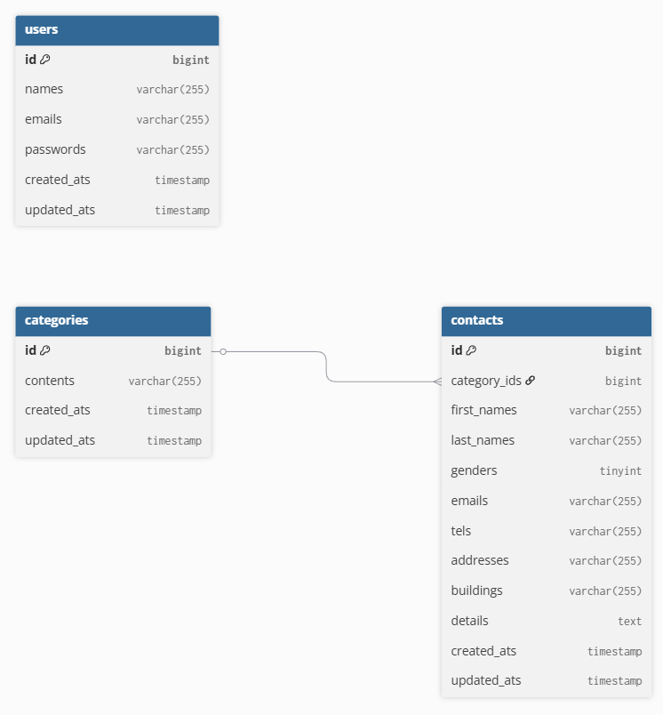

お問い合わせフォームアプリケーション
環境構築
このアプリケーションをローカル環境でセットアップし、実行するための手順を以下に示します。

1. リポジトリのクローン
まず、GitHubリポジトリをローカルにクローンします。

git clone git@github.com:starmine448357/kadai.git
cd kadai

2. Dockerコンテナのビルドと起動
Docker Composeを使用して、必要なサービス（PHP、Nginx、MySQLなど）のコンテナをビルドし、起動します。

docker-compose up -d --build

--build オプションは、Dockerfileの変更があった場合にイメージを再ビルドします。初回起動時には必ず必要です。

3. Composerパッケージのインストール
PHPコンテナ内でComposerを実行し、Laravelの依存関係パッケージをインストールします。

docker exec -it kadai-php-1 composer install

kadai-php-1 は、docker-compose.yml で定義されているPHPサービスコンテナの名前に合わせてください。

4. .env ファイルの作成と設定
Laravelの設定ファイルである .env ファイルを作成し、データベース接続情報などを設定します。

docker exec -it kadai-php-1 cp .env.example .env

作成された .env ファイルをエディタで開き、以下のデータベース接続情報をプロジェクトに合わせて設定してください。

DB_CONNECTION=mysql
DB_HOST=mysql # docker-compose.yml のMySQLサービス名
DB_PORT=3306
DB_DATABASE=laravel # データベース名 (任意で変更)
DB_USERNAME=root # データベースユーザー名 (任意で変更)
DB_PASSWORD= # MySQLのrootパスワード (設定していなければ空欄)

5. アプリケーションキーの生成
Laravelアプリケーションのセキュリティキーを生成します。

docker exec -it kadai-php-1 php artisan key:generate

6. データベースマイグレーションとシーディング
データベースのテーブルを作成し、初期データを投入します。

docker exec -it kadai-php-1 php artisan migrate:fresh --seed

注意: このコマンドは、データベースの全ての既存テーブルを削除し、マイグレーションを最初から再実行した後、シーダーを実行します。開発環境以外で実行すると、データが失われるため十分注意してください。

7. キャッシュクリア (任意)
変更が反映されない場合や、予期せぬエラーが発生する場合に実行してください。

docker exec -it kadai-php-1 php artisan cache:clear
docker exec -it kadai-php-1 php artisan config:clear
docker exec -it kadai-php-1 php artisan route:clear
docker exec -it kadai-php-1 php artisan view:clear

使用技術(実行環境)
言語: PHP 8.x

フレームワーク: Laravel 10.x (またはそれ以降のバージョン)

データベース: MySQL (Dockerコンテナ)

コンテナ: Docker, Docker Compose

パッケージ管理: Composer

フロントエンド: HTML, CSS (Tailwind CSSは使用していません), JavaScript

ER図

URL
開発環境: http://localhost/
docker-compose.yml のNginxサービスで設定されているポートによって異なる場合があります。通常はポート80でアクセス可能です。

